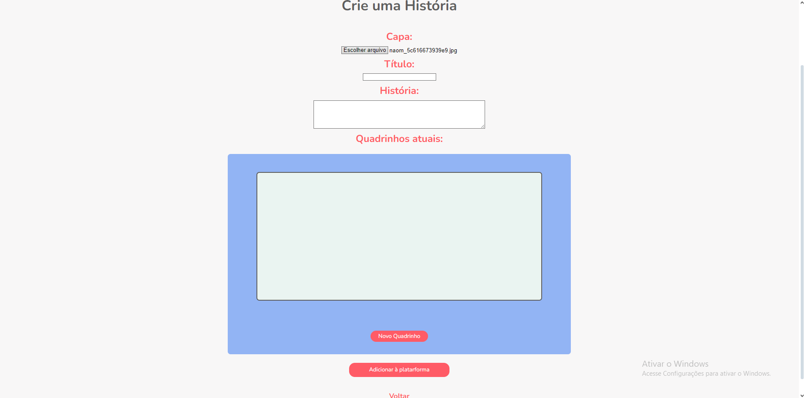
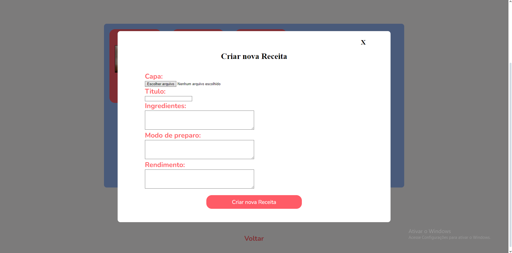

# NutriKids

Projeto Final do Ciclo 1 - Alpha EdTech

***

### Proposta
Desenvolver um site voltado ao público infantil, que traga conhecimento culinário e nutricional por meio de histórias, quizzes e jogos para entreter as crianças. Além de receitas para estimular os menores à cozinharem e se introduzirem à novos ingredientes.

***

### Funcionalidade
O NutriKids permite que você tenha um acesso como administrador, via login e senha (criptografada), ou usuário, apenas com a inserção de um apelido qualquer.

Os administradores gerenciam histórias em quadrinhos, quizzes e receitas no site, eles são capazes de criar, editar e deletar estes recursos.

Um quiz é formado por: capa, título e uma lista de perguntas. As perguntas solicitam texto da questão, quatro opções de resposta (sendo uma o gabarito) e uma explicação.

Uma história é formada por: capa, título, descrição e uma lista de imagens/quadrinhos.

Uma receita é formada por: capa, título, ingredientes, modo de preparo e rendimento.

Como é possível observar, cada um destes possuem suas peculiaridades com tipos de dados diferentes, mas o sistema está preparado para receber e adicionar normalmente uma história, quiz ou receita na plataforma.

Já usuários podem apenas ler estes recursos e jogar, administradores não tem o poder de editar jogos, já que estes são desenvolvidos no próprio código.

***

### Como utilizar a aplicação
Baixe as pastas e utilize o comando ``npm i`` no terminal para instalar todas as bibliotecas que o projeto solicita, localizadas no arquivo ``package.json``. Após isso, crie um arquivo chamado ``.env`` para colocar algumas configurações sensíveis que não estão disponíveis publicamente: porta, configurações do banco de dados e a chave de acesso para o JWT.

Por fim, abra o servidor express com o comando ``npm start``, lembre-se de criar um banco de dados que condiz com os dados fornecidos em sua configuração no ``.env``.

***

### Contribuição

Este projeto foi desenvolvido pelos seguintes contribuintes:
- [Anita Yumi Kawasaki](https://github.com/aanitakawasaki)
- [Guilherme da Silva Ferreira de Moraes](https://github.com/GuilhermeSFMoraes)
- [Murilo Barbosa Cardoso](https://github.com/murilobarbosaa)
- [Pedro Lucas Fernandes Ferreira](https://github.com/PedroLucasFernandes)
